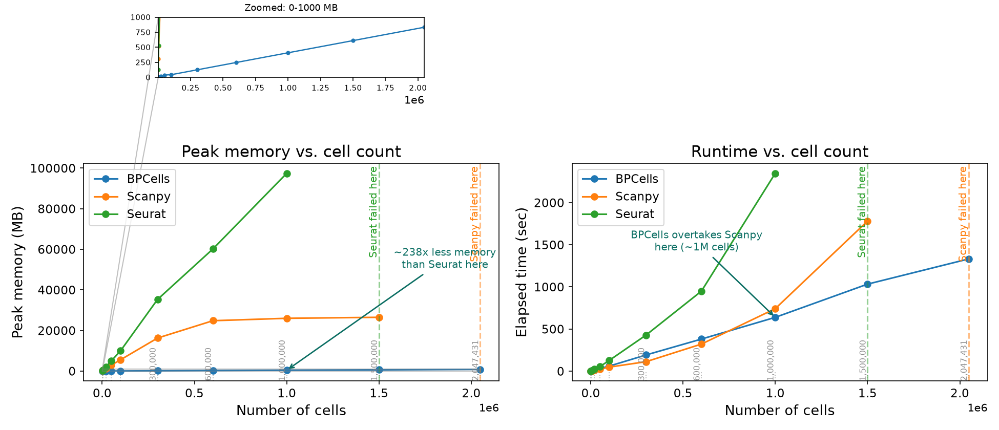
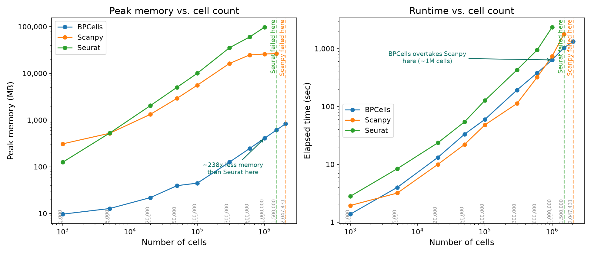

# scRNA-seq Preprocessing Benchmark: Scanpy vs. Seurat vs. BPCells

Runtime and peak-memory benchmark of three scRNA-seq preprocessing tools — **Scanpy** (Python, in-memory sparse matrix), **Seurat** (R, in-memory sparse matrix), and **BPCells** (R, disk-backed streaming matrix) — on mouse adipose tissue single-cell RNA-seq data (PanSci dataset: BAT, iWAT, gWAT, ages 3/6/23 months, both sexes, ~2.05M cells), from 1,000 cells up to the full ~2,047,431-cell dataset.

## Motivation

Single-cell experiments increasingly reach into the millions of cells, but tool choice is often habit-based rather than measured. Our lab has mainly relied on R; the real question this benchmark answers is **which tool to use, and when to switch**, as datasets outgrow what a normal desktop can hold in memory.

## Experimental design

Benchmark design aligned with Parks & Greenleaf (2025, bioRxiv 2025.03.27.645853).

- **Scale points (10):** 1K / 5K / 20K / 50K (quick checks), 100K / 300K (key comparison range), 600K / 1M / 1.5M (large-scale stress tests), 2,047,431 (full dataset)
- **Reliability:** 3 independent rounds, averaged
- **Fairness controls:**
  1. Single-threaded execution on an ordinary 32 GB RAM laptop (no HPC/cluster)
  2. Isolated process per run, for clean memory measurement
  3. Each tool selects its own highly variable genes natively (no shared gene list forced across tools)

## Pipeline

Filter genes → Normalize → log1p → HVG (top 2,000) → Scale (z-score) → PCA (50 PCs). Timing stops right after PCA — no clustering or UMAP — since this benchmark is scoped to preprocessing only.

## Results





- **BPCells** — peak memory stays under 850 MB even at 2.05M cells (~238× less than Seurat at 1M cells).
- **Seurat** fails at 1.5M cells — it already needs ~95 GB just to reach 1M.
- **Scanpy** scales further (to 1.5M) but fails on the full 2.05M-cell dataset.
- **Crossover ~1M cells:** BPCells overtakes Scanpy in runtime as Scanpy starts swapping to disk.

## Conclusion

| Scale | Recommendation |
|---|---|
| < 1M cells | **Scanpy** — mature ecosystem, competitive runtime, memory still manageable |
| ~1M cells (crossover) | **BPCells** overtakes Scanpy in both memory and runtime |
| > 1.5M cells | **Seurat fails (OOM)**; **BPCells** is the only tool that scales to the full atlas |

For datasets under ~1M cells, tool choice is mostly a matter of ecosystem preference. Past that point, BPCells' disk-backed streaming design is what makes preprocessing the full ~2M-cell atlas possible at all on ordinary hardware — Seurat's in-memory approach runs out of RAM, and Scanpy's memory footprint eventually forces disk swapping that erases its runtime advantage.

## Structure

```
scripts/
  benchmark/              benchmark runner scripts (Scanpy/Seurat/BPCells) + summarizing/averaging
  requirements.txt         Python dependencies
  requirement_r.R          R dependencies

results/
  benchmark_comparison_linear.png / _loglog.png   runtime & memory vs. cell count
  benchmark_results*.csv, benchmark_summary.xlsx   raw + averaged benchmark timings
```

## Data

Raw data and the per-scale benchmark input matrices (`results/benchmark_data/n_*/`) are **not included** — together they run to well over 10 GB, beyond what's practical for git. The PanSci mouse adipose dataset is the original source; the benchmark inputs are reproducible from it by running the scripts in `scripts/benchmark/` in order.

A related aging-atlas annotation analysis on the same dataset lives in a separate repo: [`adipose-aging-atlas`](https://github.com/seannnn2006/adipose-aging-atlas).